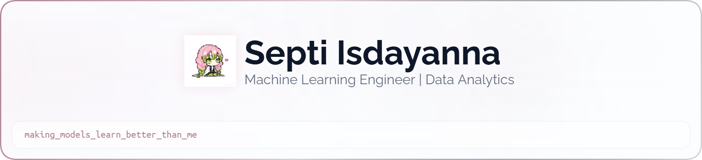

<picture>
  <source media="(prefers-color-scheme: dark)" srcset="art/header-dark.png">
  
</picture>

<h1 align="center">Hey there, I'm Septi Isdayanna 👋</h1>

  

  
  
  

 

<table align="center">
  <tr>
    <td width="65%" valign="middle">

## About Me

I’m **Septi Isdayanna**, a fresh graduate in **Applied Informatics** with a growing focus on **Machine Learning, Data Analysis, and AI-driven applications**.

I enjoy turning datasets and real-world problems into practical solutions through data exploration, machine learning, visualization, and application development.

My current interests include:

- Machine Learning & Predictive Modeling
- Data Analysis & Exploratory Data Analysis
- Explainable AI (XAI)
- Data Visualization
- Streamlit-based Data Applications
- MLOps & Model Deployment

I’m continuously improving my technical skills by building projects that combine **data, machine learning, and practical applications**.

    </td>
    <td width="35%" align="center" valign="middle">
      
    </td>
  </tr>
</table>

 

## Tech Stack

  

  

 

## GitHub Statistics

  
  

 

## Contribution Snake

<!--
This section is generated automatically by GitHub Actions.
Workflow example:
.github/workflows/snake.yml
-->

  <picture>
    <source media="(prefers-color-scheme: dark)" srcset="https://raw.githubusercontent.com/septiisdayanna/septiisdayanna/output/github-contribution-grid-snake-dark.svg">
    <source media="(prefers-color-scheme: light)" srcset="https://raw.githubusercontent.com/septiisdayanna/septiisdayanna/output/github-contribution-grid-snake.svg">
    
  </picture>

 

## Connect With Me

  
  
  
  
  

 

  

